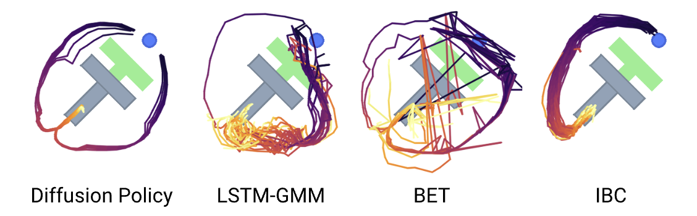

# Consistency Policy

[[Project page]](TODO)
[[Paper]](TODO)
[[Data]](TODO)


[Aaditya Prasad](TODO)<sup>1</sup>,
[Kevin Lin](https://kevin-thankyou-lin.github.io/)<sup>1</sup>,
[Linqi Zhou](https://alexzhou907.github.io/)<sup>1</sup>,
[Jeannette Bohg](https://web.stanford.edu/~bohg/)<sup>1</sup>,


<sup>1</sup>Stanford University




# Basic Usage

## Installation
The below instructions are copied from [Diffusion Policy](https://github.com/real-stanford/diffusion_policy), though our conda_environment.yaml is different than theirs. 

To reproduce our simulation benchmark results, install our conda environment on a Linux machine with Nvidia GPU. On Ubuntu 20.04 you need to install the following apt packages for mujoco:
```console
$ sudo apt install -y libosmesa6-dev libgl1-mesa-glx libglfw3 patchelf
```

We recommend [Mambaforge](https://github.com/conda-forge/miniforge#mambaforge) instead of the standard anaconda distribution for faster installation: 
```console
$ mamba env create -f conda_environment.yaml
```

but you can use conda as well: 
```console
$ conda env create -f conda_environment.yaml
```

## Training
Training is done similarly to [Diffusion Policy](https://github.com/real-stanford/diffusion_policy). The user defines a config yaml file with their desired parameters and then runs the following command:
```console
(consistency-policy)[Consistency_Policy]$ python train.py --config-dir=configs/ --config-name=edm_square.yaml
```
Example configs for the robomimic square task are provided in the configs/ directory. Three types of networks are supported in this implementation and are referred to by their diffusion framework: EDM, CTMP, DDIM. 

To train a policy, pick a desired framework and update task, dataset, and shape_meta keys, as well as any other hyperparamaters. If you are training without an online sim, set training.online_rollouts=false. You should always set training.inference_mode=false while training. As a side note, 

Below are specific instructions for the different networks. 

### Teacher Network (EDM)
Before distilling a few-step Consistency Policy, a teacher network needs to be trained. The implemented teacher network follows the [EDM](https://arxiv.org/abs/2206.00364) diffusion framework. policy.noise_scheduler is the key introduced paramater; this controls the noise scheduler and diffusion process. If you have not worked with diffusion models before, the main paramater to concern yourself with is policy.noise_scheduler.bins, which is 80 in the example configs. This is the number of discretization steps in the backwards diffusion process. This number does not affect training speed (and can be changed after/during training). More bins leads to more accurate policy inference (which will show up in mse_error and eval scores) and longer inference times. 

### Student Network (CTMP)
Once you have a trained teacher checkpoint, you are ready to distill a Consistency Policy. Set policy.teacher_path in the config to the desired ckpt path. It is heavily recommended to warm-start your CP with the teacher checkpoint, which only requires setting policy.edm to the same path as policy.teacher_path (you could set these to two different paths but there is no good reason to do so). 

Your student and teacher must have the same policy.diffusion_step_embed_dim! Ensure that these are the same and check your EDM cfg for the correct value if you are not sure.

As with the teacher network, policy.noise_scheduler contains most of the specialized hyperparamaters. 
## Deploying


## 🧾 Checkout our experiment logs!

## 🛠️ Installation

### 🦾 Real Robot

## 🖥️ Reproducing Simulation Benchmark Results 
### Download Training Data
Under the repo root, create data subdirectory:
```console
[diffusion_policy]$ mkdir data && cd data
```

Download the corresponding zip file from [https://diffusion-policy.cs.columbia.edu/data/training/](https://diffusion-policy.cs.columbia.edu/data/training/)
```console
[data]$ wget https://diffusion-policy.cs.columbia.edu/data/training/pusht.zip
```

Extract training data:
```console
[data]$ unzip pusht.zip && rm -f pusht.zip && cd ..
```

Grab config file for the corresponding experiment:
```console
[diffusion_policy]$ wget -O image_pusht_diffusion_policy_cnn.yaml https://diffusion-policy.cs.columbia.edu/data/experiments/image/pusht/diffusion_policy_cnn/config.yaml
```

### Running for a single seed
Activate conda environment and login to [wandb](https://wandb.ai) (if you haven't already).
```console
[diffusion_policy]$ conda activate robodiff
(robodiff)[diffusion_policy]$ wandb login
```

Launch training with seed 42 on GPU 0.
```console
(robodiff)[diffusion_policy]$ python train.py --config-dir=. --config-name=image_pusht_diffusion_policy_cnn.yaml training.seed=42 training.device=cuda:0 hydra.run.dir='data/outputs/${now:%Y.%m.%d}/${now:%H.%M.%S}_${name}_${task_name}'
```


### 🆕 Evaluate Pre-trained Checkpoints
TODO

## 🦾 Demo, Training and Eval on a Real Robot
TODO

## 🔩 Key Components
TODO


## 🏷️ License
This repository is released under the MIT license. See [LICENSE](LICENSE) for additional details.

## 🙏 Acknowledgement
TODO
