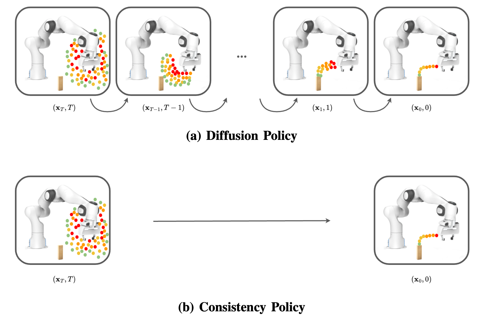

# Consistency Policy: Accelerated Visuomotor Policies via Consistency Distillation

[[Project page]](https://consistency-policy.github.io/)
[[Paper]](https://arxiv.org/abs/2405.07503)


[Aaditya Prasad](https://aaditya-prasad.github.io/)<sup>1</sup>,
[Kevin Lin](https://kevin-thankyou-lin.github.io/)<sup>1</sup>,
[Jimmy Wu](https://jimmyyhwu.github.io/)<sup>2</sup>,
[Linqi Zhou](https://alexzhou907.github.io/)<sup>1</sup>,
[Jeannette Bohg](https://web.stanford.edu/~bohg/)<sup>1</sup>


<sup>1</sup>Stanford University
<sup>2</sup>Princeton University

_Robotics: Science and Systems (RSS), 2024_



## Overview
Consistency Policies are fast and performant visuomotor policies. Consistency Policy (CP) works by distilling a teacher diffusion policy into a single or few-step student policy. This repo provides instructions and best practices for usage on your own tasks. More details can be found in [our paper](https://arxiv.org/abs/2405.07503). 

## Installation
The below instructions are copied from [Diffusion Policy](https://github.com/real-stanford/diffusion_policy), though our conda_environment.yaml is different from theirs. 

Install our conda environment on a Linux machine with Nvidia GPU. On Ubuntu 20.04 you need to install the following apt packages for mujoco:
```console
$ sudo apt install -y libosmesa6-dev libgl1-mesa-glx libglfw3 patchelf
```

We recommend [Mambaforge](https://github.com/conda-forge/miniforge#mambaforge) instead of the standard anaconda distribution for faster installation: 
```console
$ mamba env create -f conda_environment.yaml
```

but you can use conda as well: 
```console
$ conda env create -f conda_environment.yaml
```

You can also login to wandb if you wish to log your training runs. 
```console
[consistency-policy]$ conda activate consistency-policy
(consistency-policy)[consistency-policy]$ wandb login
```
## Training
Training is done similarly to [Diffusion Policy](https://github.com/real-stanford/diffusion_policy). The user defines a config yaml file with their desired parameters and then runs the following command:
```console
(consistency-policy)[consistency-policy]$ python train.py --config-dir=configs/ --config-name=edm_square.yaml logging.name=edm_square
```
Example configs for the [Robomimic](https://robomimic.github.io/docs/datasets/robomimic_v0.1.html) Square task are provided in the configs/ directory. Three types of networks are supported in this implementation and are referred to by their diffusion framework: EDM, CTMP, DDIM; the terminal code above is using the EDM config. Ensure that your dataset is downloaded to the appropriate folder as denoted by the dataset paths in the cfg; for Robomimic tasks, you can find download instructions in [Diffusion Policy](https://arc.net/l/quote/pdmnqzdc).

To train a policy, pick a desired framework and update ```task```, ```dataset```, and ```shape_meta keys``` to match your task. If you are training without an online sim, set ```training.online_rollouts=false```. You should always set ```training.inference_mode=false``` while training. 

Below are specific instructions for the different networks. 

### Teacher Network (EDM)
Before distilling a few-step Consistency Policy, a teacher network needs to be trained. The implemented teacher network follows the [EDM](https://arxiv.org/abs/2206.00364) diffusion framework. ```policy.noise_scheduler``` holds the key introduced hyperparameters; this controls the noise scheduler and diffusion process. If you have not worked with diffusion models before, ```policy.noise_scheduler.bins```, which is 80 in the example configs, is the main parameter you might wish to change. This is the number of discretization steps in the backwards diffusion process. This number does not affect training speed (and can be changed after/during training). More bins leads to more accurate policy inference (which will show up in mse_error and eval scores) and longer inference times. 

### Student Network (CTMP)
Once you have a trained teacher checkpoint, you are ready to distill a Consistency Policy. Set ```policy.teacher_path``` in the config to the desired ckpt path. It is heavily recommended to warm-start your CP with the teacher checkpoint, which only requires setting ```policy.edm``` to the same path as ```policy.teacher_path```. 

Your student and teacher must have the same ```policy.diffusion_step_embed_dim```! Ensure that these are the same and check your EDM cfg for the correct value if you are not sure.

As with the teacher network, ```policy.noise_scheduler``` contains most of the specialized hyperparameters. Increasing the number of bins increases training convergence time as well as the accuracy of the converged model, though both of these effects vary in size. Additionally, ```policy.losses``` lists the objectives that are taken into account (```dsm``` and ```ctm```) as well as their multipliers: these correspond to $\alpha$ and $\beta$ in Eq. 8 of the paper and allow you to adjust the relative weighting of the losses. 

By default, you are training and evaluating a single-step network. For multi-step inference, see the Deploying section below.  

### Baseline Network (DDiM)
The baseline network is largely the same as in Diffusion Policy's implementation, and uses the Hugging Face DDiM noise scheduler. ```policy.num_inference_steps``` plays a similar role to the teacher network's ```policy.noise_scheduler.bins```. The number of inference steps can be changed at test time and increases both accuracy and inference time. The baseline network cannot be used for distilation but can be useful to check your setup with, since it doesn't require the training of both a teacher and student network. 

## Deploying

Once you have trained a policy, you can use the ```get_policy``` function in ```consistency_policy.utils``` to load an inference-ready version of the policy from a checkpoint. If you wish to change any of the test-time hyperparameters of the policy, you can pass in a new config with your desired changes. By default, ```get_policy``` loads the config that the model was trained with, activates inference mode, and deactivates online rollouts. 

We also include a ```PolicyWrapper``` that wraps a provided policy with action and observation chunking. ```example.ipynb``` shows an example of loading a policy, wrapping it, and generating new actions; starter code is also copied below:

```python
import torch
from torch import nn
from diffusion_policy.dataset.base_dataset import BaseImageDataset, LinearNormalizer
from consistency_policy.utils import get_policy, rmat_to_quat, rot6d_to_rmat
from consistency_policy.policy_wrapper import PolicyWrapperRobomimic
import numpy as np

ckpt_path = 'outputs/ctm/checkpoints/epoch=0200-val_mse_error=0.228.ckpt'

policy = get_policy(ckpt_path)

device = 'cuda' if torch.cuda.is_available() else 'cpu'
policy = policy.to(device)
policy.eval()
for param in policy.parameters():
    param.requires_grad = False

pw = PolicyWrapperRobomimic(policy, n_obs=2, n_acts=8, d_pos=6, d_rot=6, device=device)

# These must match the shape_meta you defined in your cfg
obs = {
    'base_pose': np.zeros(3),
    'arm_pos': np.zeros(3),
    'arm_quat': np.zeros(4),
    'gripper_pos': np.zeros(1),
    'base_image': np.zeros((84, 84, 3), dtype=np.uint8),
    'wrist_image': np.zeros((84, 84, 3), dtype=np.uint8),
}

action = pw.get_action(obs)
```

As mentioned earlier, a Consistency Policy can complete multi-step inference at test time. Before chaining is enabled, you must define the timesteps that you wish to chain at under ```policy.chaining_times```. We found that even partitions of discretized time work well as a heurstic: thus, our default setting is ```policy.chaining_times = ['D',27,54]``` for three-step inference that chains from 0, 27, and 54 bins. Once you have set this parameter, you must call ```policy.enable_chaining()``` (```PolicyWrapper``` supports this method as well). More details and an explanation of chaining can be found in our paper. 

## Bibtex
You can cite this work at 
```
@inproceedings{prasad2024consistency,
  title     = {Consistency Policy: Accelerated Visuomotor Policies via Consistency Distillation},
  author    = {Prasad, Aaditya and Lin, Kevin and Wu, Jimmy and Zhou, Linqi and Bohg, Jeannette},
  booktitle = {Robotics: Science and Systems},
  year      = {2024},
}

```

## License
This repository is released under the MIT license. See [LICENSE](LICENSE) for additional details.

## Acknowledgement
Much of our implementation is adapted from [Diffusion Policy](https://github.com/real-stanford/diffusion_policy)
